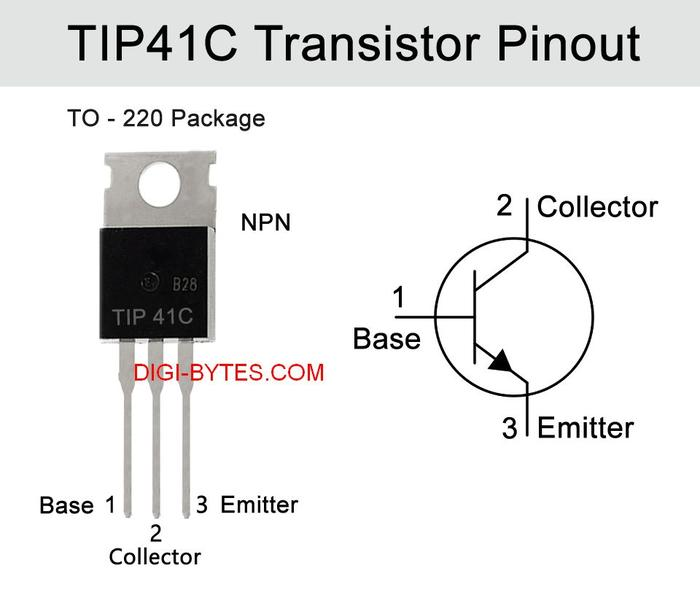
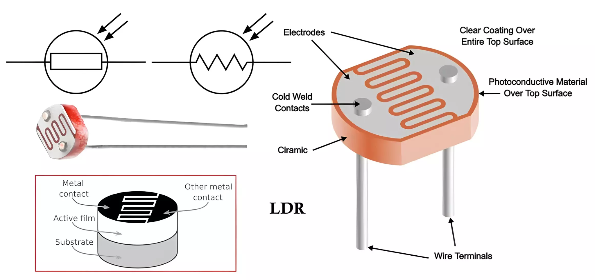
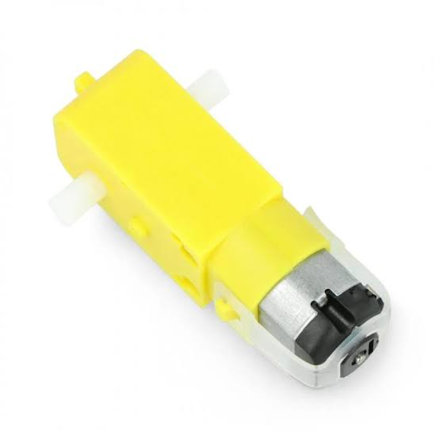
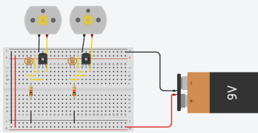

# Light-Follower

A simple **Light Follower circuit using LDR, transistor, resistor, and DC motor**.

The circuit controls the movement and speed of a DC motor based on the intensity of light detected by the LDR. Changes in light intensity cause changes in the LDR resistance, which affects the current flowing through the transistor and DC motor.

---

## List of Content

- [Introduction](#Introduction)
- [Literature](#Literature)
- [Design](#Design)
- [Programs](#Programs)
- [Result](#Result)

---

## Introduction

This project develops a simple **Light Follower circuit** that controls the movement of a DC motor based on light intensity.

The circuit consists of:

- **LDR (Light Dependent Resistor)** — detects light intensity.
- **TIP41C Transistor** — controls the current flowing to the motor.
- **1 kΩ Resistor** — controls the current in the circuit.
- **DC Motor / Gearbox** — converts electrical energy into mechanical movement.

The objectives of this project are:

1. To understand the Light Follower circuit.
2. To understand the concept of **Kirchhoff's Voltage Law (KVL)**.
3. To build a Light Follower circuit.
4. To understand and operate the Light Follower circuit.

---

## Literature

### Kirchhoff's Voltage Law

KVL is a fundamental principle used in electrical circuit analysis. It states that the algebraic sum of all voltages around a closed loop is equal to zero.

In the Light Follower circuit, KVL can be used to analyze the voltage across the power source, resistor, LDR, transistor, and motor. Changes in LDR resistance affect the voltage distribution in the circuit and consequently affect the transistor current.

### Transistor

<p align="center">
  
</p>

A transistor is a semiconductor component with three terminals: **base, emitter, and collector**.

The transistor can function as an amplifier or an electronic switch. In the Light Follower circuit, it controls the current flowing to the DC motor according to the signal received from the light-sensing circuit.

### LDR (Light Dependent Resistor)

<p align="center">
  
</p>

The **Light Dependent Resistor (LDR)** is a semiconductor component whose resistance changes according to the intensity of light received.

When the light intensity increases, the resistance of the LDR decreases and the current increases. Conversely, when the light intensity decreases, the resistance increases and the current decreases.

In this project, the LDR acts as the main light sensor and controls the transistor according to changes in light intensity.

### Resistor

A resistor is a passive electronic component that provides resistance to the flow of electric current.

In the Light Follower circuit, the resistor works together with the LDR to control current and convert changes in LDR resistance into changes in voltage and current that can control the transistor.

### DC Motor

<p align="center">
  
</p>

A **DC motor** converts electrical energy into mechanical energy.

In the Light Follower circuit, the DC motor acts as the mechanical output. When the light intensity changes, the LDR resistance changes, affecting the transistor current and consequently the speed of the DC motor.

---

## Design

### Hardware Design

<p align="center">
  
</p>

| Component | Quantity | Function |
|:---|:---:|:---|
| **PCB** | 1 | Main circuit board |
| **1 kΩ Resistor** | 1 | Controls current |
| **LDR** | 2 | Detects light intensity |
| **TIP41C Transistor** | 2 | Controls motor current |
| **Impraboard** | 1 | Circuit construction |
| **9V Battery** | 1 | Power source |
| **Gearbox** | 2 | Mechanical drive |
| **1.5V Battery** | 4 | Additional power source |
| **Solder** | As needed | Component connections |
| **Soldering Iron** | 1 | Circuit assembly |

### System Workflow

```text
Light Intensity
       ↓
      LDR
       ↓
Change in Resistance
       ↓
    Transistor
       ↓
 Change in Current
       ↓
    DC Motor
       ↓
Mechanical Movement
```

### Working Principle

The Light Follower converts changes in light intensity into changes in DC motor movement.

When the light intensity received by the LDR increases, its resistance decreases. This affects the voltage and current in the circuit and allows the transistor to conduct current to the DC motor.

When the current through the motor increases, the motor rotates faster. Conversely, when the light intensity decreases, the LDR resistance increases and the motor current decreases. The motor can therefore rotate more slowly or stop.

```text
Higher Light Intensity
        ↓
   LDR Resistance ↓
        ↓
   Transistor Current ↑
        ↓
    Motor Speed ↑
```

```text
Lower Light Intensity
        ↓
   LDR Resistance ↑
        ↓
   Transistor Current ↓
        ↓
    Motor Speed ↓
```

### Assembly Procedure

1. Prepare all required components.
2. Create the Light Follower schematic.
3. Solder the components onto the PCB according to the schematic.
4. Connect the gearbox to the completed circuit.
5. Check whether the circuit operates correctly.
6. Perform the experiment.
7. Collect and analyze the experimental data.

---

## Programs

This project **does not require a microcontroller program**.

The Light Follower operates entirely through an electronic circuit consisting of the LDR, transistor, resistor, and DC motor.

---

## Result

The Light Follower was tested under different light conditions, distances, and supply voltages.

### Condition: Bright — 6 V

| Distance | Travel Time | Motor Speed | Output Voltage |
|:---:|---:|:---:|:---:|
| **0.2 m** | 3.96 s | Fast | 1.0 V |
| **0.4 m** | 4.44 s | Fast | 1.0 V |
| **0.6 m** | 6.89 s | Fast | 1.0 V |

### Condition: Dark — 6 V

| Distance | Travel Time | Motor Speed | Output Voltage |
|:---:|---:|:---:|:---:|
| **0.2 m** | 1.9 s | Fast | 1.6 V |
| **0.4 m** | 4.2 s | Fast | 1.6 V |
| **0.6 m** | 6.0 s | Fast | 1.6 V |

### Condition: Bright — 9 V

| Distance | Travel Time | Motor Speed | Output Voltage |
|:---:|---:|:---:|:---:|
| **0.2 m** | 4.0 s | Fast | 1.5 V |
| **0.4 m** | 5.2 s | Fast | 1.5 V |
| **0.6 m** | 7.0 s | Fast | 1.5 V |

### Condition: Dark — 9 V

| Distance | Travel Time | Motor Speed | Output Voltage |
|:---:|---:|:---:|:---:|
| **0.2 m** | 2.4 s | Fast | 1.8 V |
| **0.4 m** | 5.0 s | Fast | 1.8 V |
| **0.6 m** | 6.2 s | Fast | 1.8 V |

### Experimental Analysis

The results show a relationship between **light condition, applied voltage, distance, and gearbox movement**.

Under the tested conditions, the motor speed was recorded as **Fast**. The measured output voltage was different between bright and dark conditions and also increased when the supply voltage was increased from 6 V to 9 V.

The results demonstrate that changes in light intensity change the LDR resistance, which affects the current flowing through the transistor and motor. Higher current can increase the DC motor speed, while lower current can reduce the speed or stop the motor. The applied supply voltage also affects the current and speed of the gearbox.

---
